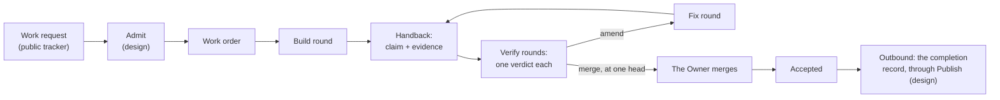
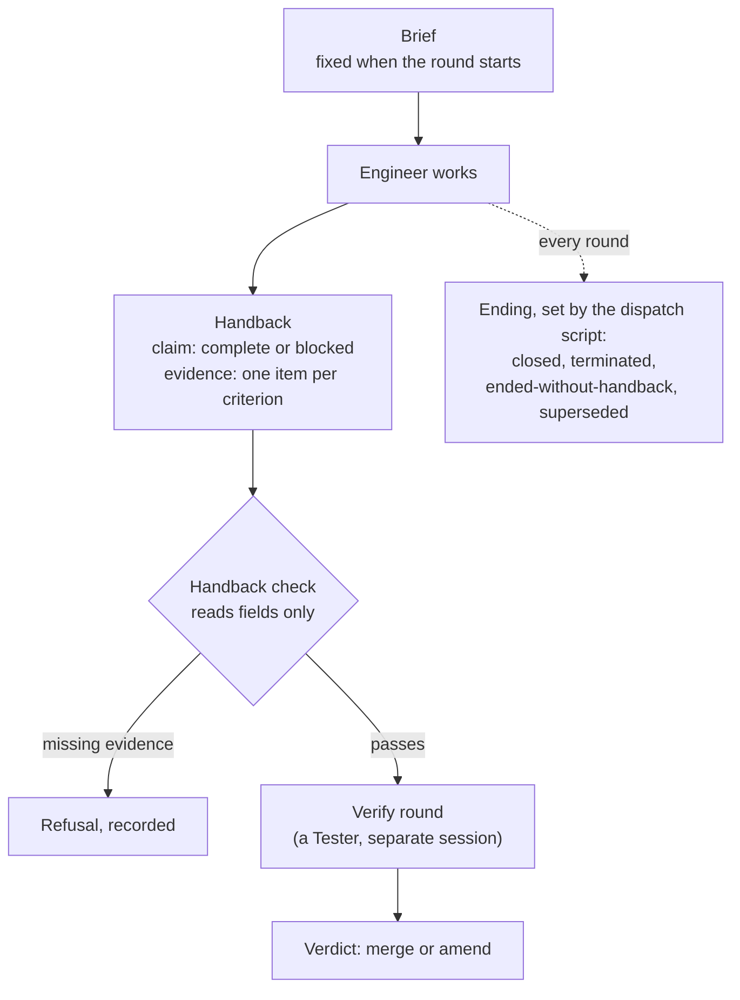
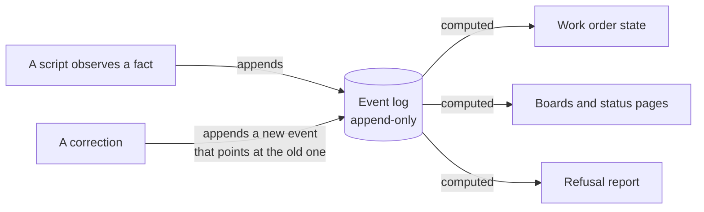
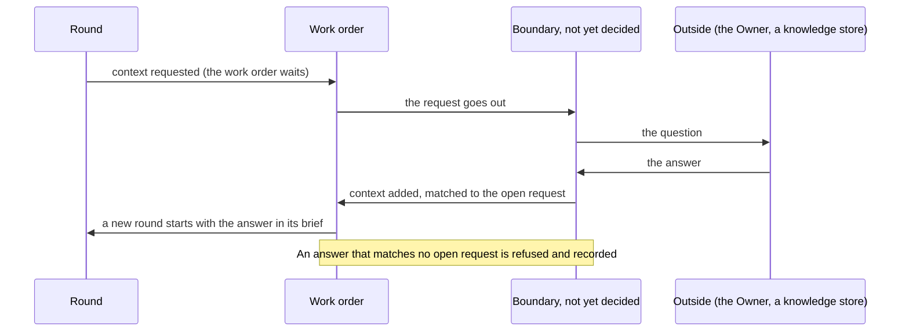

# Flows

Four pictures of how work is meant to move through the factory, in the words of
the [glossary](glossary.md). They show the **design**. Where today's practice
differs, the text under each picture says so. For the path a piece of work takes
today, step by step, see [how a piece of work moves](lifecycle.md); these
pictures are the same path in the design's terms.

## 1. The big picture

A work request becomes one or more work orders. Each work order is worked in
rounds: a build round, then verify rounds that each give a verdict. An amend
sends the work into a fix round, and the new head is verified again. When the
verify rounds pass at one head and the Owner merges, the work order is
accepted.

**Today and design.** Admit and Publish, the two doors of
[ADR 0002](adr/0002-audience-and-the-two-doors.md), are design: today work is
opened as a ticket and the Owner posts publicly by hand. The merge is the
Owner's in both.

## 2. A round's life

Three words, three owners. The **claim** is the Engineer's own report on its
round. The **verdict** is a Tester's judgment, given in a separate verify round.
The **ending** is how the round stopped, recorded by the script that ran it,
never by the Engineer.

**Today and design.** Briefs, handbacks with evidence, separate Tester sessions
and verdicts on an exact commit hold today. A handback whose evidence is a set
of named fields, and refusals recorded as events, are design.

## 3. The record

The process that observes a fact writes it as an event. Nothing is edited after
it is written; a correction is a new event. Work-order state, boards and status
pages are computed from the events, so a wrong page is fixed in the events or in
the code that draws it, never by hand.

**Today and design.** Round events are appended today. Work-order events,
computed state and the refusal report are design; some status pages are still
kept by hand.

## 4. Asking for context

A step works from what its brief gives it. When something is missing, the
request goes out and the answer comes back as an addition to the work order.
The intent is that the request reaches the Owner through a channel separate
from Publish; until that channel is built, how the request and the answer cross
the boundary is not yet decided. Rounds already run keep the inputs they had.
If the question changes what the work is for, the work order is replaced by a
new one that points at it, instead of being amended (design).

**Today and design.** Today a step that is missing something stops and asks.
The request and answer as recorded events on the work order are design.

## How these relate to the lifecycle page

[How a piece of work moves](lifecycle.md) describes today's path in ten steps,
from a ticket to the record. These pictures cover the same path in the
design's words: its ticket becomes the work order, its build and fix steps are
rounds, its re-run is the Tech Lead's own check before the verify rounds, not a
round, its cross-vendor review is the verify rounds and their verdicts, and its
record is the event log of picture 3. Where the lifecycle page says a step "is
planned, not built", the pictures mark the same step as design.
